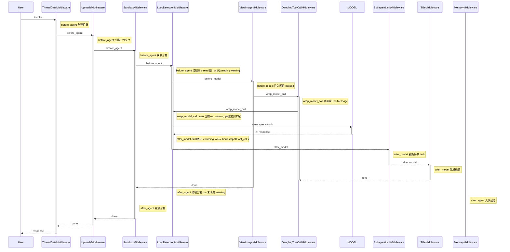
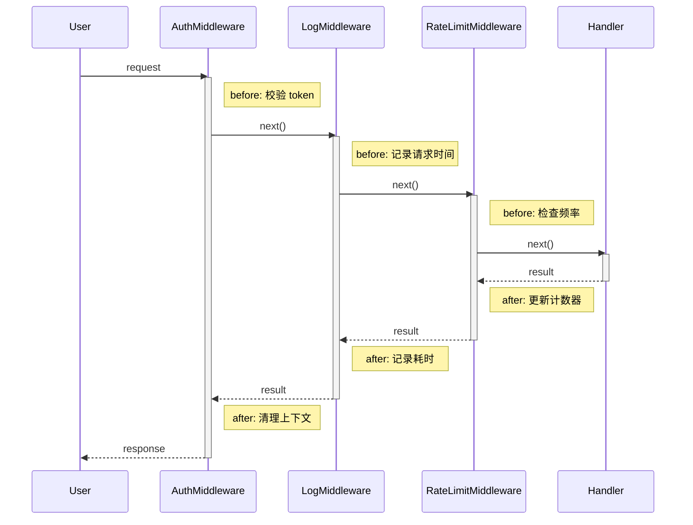
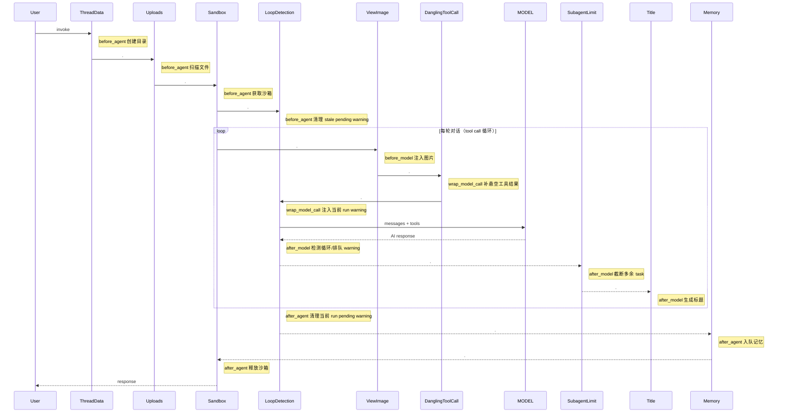

# Middleware 执行流程

## Middleware 列表

`create_deerflow_agent` 通过 `RuntimeFeatures` 组装的完整 middleware 链（默认全开时）：

| # | Middleware | `before_agent` | `before_model` | `after_model` | `after_agent` | `wrap_model_call` | `wrap_tool_call` | 主 Agent | Subagent | 来源 |
|---|-----------|:-:|:-:|:-:|:-:|:-:|:-:|:-:|:-:|------|
| 0 | ThreadDataMiddleware | ✓ | | | | | | ✓ | ✓ | `sandbox` |
| 1 | UploadsMiddleware | ✓ | | | | | | ✓ | ✗ | `sandbox` |
| 2 | SandboxMiddleware | ✓ | | | ✓ | | | ✓ | ✓ | `sandbox` |
| 3 | DanglingToolCallMiddleware | | | | | ✓ | | ✓ | ✗ | 始终开启 |
| 4 | GuardrailMiddleware | | | | | | ✓ | ✓ | ✓ | *Phase 2 纳入* |
| 5 | ToolErrorHandlingMiddleware | | | | | | ✓ | ✓ | ✓ | 始终开启 |
| 6 | SummarizationMiddleware | | ✓ | | | | | ✓ | ✗ | `summarization` |
| 7 | TodoMiddleware | | ✓ | ✓ | | ✓ | | ✓ | ✗ | `plan_mode` 参数 |
| 8 | TitleMiddleware | | | ✓ | | | | ✓ | ✗ | `auto_title` |
| 9 | MemoryMiddleware | | | | ✓ | | | ✓ | ✗ | `memory` |
| 10 | ViewImageMiddleware | | ✓ | | | | | ✓ | ✗ | `vision` |
| 11 | SubagentLimitMiddleware | | | ✓ | | | | ✓ | ✗ | `subagent` |
| 12 | LoopDetectionMiddleware | ✓ | | ✓ | ✓ | ✓ | | ✓ | ✗ | 始终开启 |
| 13 | ClarificationMiddleware | | | | | | ✓ | ✓ | ✗ | 始终最后 |

主 agent **14 个** middleware（`make_lead_agent`），subagent **4 个**（ThreadData、Sandbox、Guardrail、ToolErrorHandling）。`create_deerflow_agent` Phase 1 实现 **13 个**（Guardrail 仅支持自定义实例，无内置默认）。

## 执行流程

LangChain `create_agent` 的规则：
- **`before_*` 正序执行**（列表位置 0 → N）
- **`after_*` 反序执行**（列表位置 N → 0）

```mermaid
graph TB
    START(["invoke"]) --> TD

    subgraph BA ["<b>before_agent</b> 正序 0→N"]
        direction TB
        TD["[0] ThreadData<br/>创建线程目录"] --> UL["[1] Uploads<br/>扫描上传文件"] --> SB["[2] Sandbox<br/>获取沙箱"] --> LD_BA["[12] LoopDetection<br/>清理 stale warning"]
    end

    subgraph BM ["<b>before_model</b> 正序 0→N"]
        direction TB
        VI["[10] ViewImage<br/>注入图片 base64"]
    end

    subgraph WM ["<b>wrap_model_call</b>"]
        direction TB
        DTC_WM["[3] DanglingToolCall<br/>补悬空 ToolMessage"] --> LD_WM["[12] LoopDetection<br/>注入当前 run warning"]
    end

    LD_BA --> VI
    VI --> DTC_WM
    LD_WM --> M["<b>MODEL</b>"]

    subgraph AM ["<b>after_model</b> 反序 N→0"]
        direction TB
        LD["[12] LoopDetection<br/>检测循环/排队 warning"] --> SL["[11] SubagentLimit<br/>截断多余 task"] --> TI["[8] Title<br/>生成标题"]
    end

    M --> LD

    subgraph AA ["<b>after_agent</b> 反序 N→0"]
        direction TB
        LD_CLEAN["[12] LoopDetection<br/>清理 pending warning"] --> MEM["[9] Memory<br/>入队记忆"] --> SBR["[2] Sandbox<br/>释放沙箱"]
    end

    TI --> LD_CLEAN
    SBR --> END(["response"])

    classDef beforeNode fill:#a0a8b5,stroke:#636b7a,color:#2d3239
    classDef modelNode fill:#b5a8a0,stroke:#7a6b63,color:#2d3239
    classDef wrapModelNode fill:#a8a0b5,stroke:#6b637a,color:#2d3239
    classDef afterModelNode fill:#b5a0a8,stroke:#7a636b,color:#2d3239
    classDef afterAgentNode fill:#a0b5a8,stroke:#637a6b,color:#2d3239
    classDef terminalNode fill:#a8b5a0,stroke:#6b7a63,color:#2d3239

    class TD,UL,SB,LD_BA,VI beforeNode
    class DTC_WM,LD_WM wrapModelNode
    class M modelNode
    class LD,SL,TI afterModelNode
    class LD_CLEAN,SBR,MEM afterAgentNode
    class START,END terminalNode
```



## 时序图



## 洋葱模型

列表位置决定在洋葱中的层级 — 位置 0 最外层，位置 N 最内层：

```
进入 before_*：   [0] → [1] → [2] → ... → [10] → MODEL
退出 after_*：    MODEL → [13] → [11] → ... → [6] → [3] → [2] → [0]
                          ↑ 最内层最先执行
```

> [!important] 核心规则
> 列表最后的 middleware，其 `after_model` **最先执行**。
> ClarificationMiddleware 在列表末尾，所以它第一个拦截 model 输出。

## 对比：真正的洋葱 vs DeerFlow 的实际情况

### 真正的洋葱（如 Koa/Express）

每个 middleware 同时负责 before 和 after，形成对称嵌套：



> [!tip] 洋葱特征
> 每个 middleware 都有 before/after 对称操作，`activate` 跨越整个内层执行，形成完美嵌套。

### DeerFlow 的实际情况

不是洋葱，是管道。大部分 middleware 只用一个钩子，不存在对称嵌套。多轮对话时 before_model / after_model 循环执行：



> [!warning] 不是洋葱
> 大部分 middleware 只用一个阶段。SandboxMiddleware 使用 `before_agent`/`after_agent` 做资源获取/释放；LoopDetectionMiddleware 也使用这两个钩子，但用途是清理 run-scoped pending warnings，不是资源生命周期对称。`before_agent` / `after_agent` 只跑一次，`before_model` / `after_model` / `wrap_model_call` 每轮循环都跑。

硬依赖只有 2 处：

1. **ThreadData 在 Sandbox 之前** — sandbox 需要线程目录
2. **Clarification 在列表最后** — `wrap_tool_call` 处理 `ask_clarification` 时优先拦截，并通过 `Command(goto=END)` 中断执行

### 结论

| | 真正的洋葱 | DeerFlow 实际 |
|---|---|---|
| 每个 middleware | before + after 对称 | 大多只用一个钩子 |
| 激活条 | 嵌套（外长内短） | 不嵌套（串行） |
| 反序的意义 | 清理与初始化配对 | 影响 `after_model` / `after_agent` 的执行优先级 |
| 典型例子 | Auth: 校验 token / 清理上下文 | ThreadData: 只创建目录，没有清理 |

## 关键设计点

### ClarificationMiddleware 为什么在列表最后？

位置最后使它在工具调用包装链中优先拦截 `ask_clarification`。如果命中，它返回 `Command(goto=END)`，把格式化后的澄清问题写成 `ToolMessage` 并中断执行。

### SandboxMiddleware 的对称性

`before_agent`（正序第 3 个）获取沙箱，`after_agent`（反序第 1 个）释放沙箱。外层进入 → 外层退出，天然的洋葱对称。

### LoopDetectionMiddleware 为什么同时用多个钩子？

`after_model` 只做检测：重复工具调用达到 warning 阈值时，把 warning 放入 `(thread_id, run_id)` 作用域的 pending 队列。真正注入发生在下一次 `wrap_model_call`：此时上一轮 `AIMessage(tool_calls)` 对应的 `ToolMessage` 已经在请求里，warning 追加在末尾，不会破坏 OpenAI/Moonshot 的 tool-call pairing。`before_agent` 清理同一 thread 下旧 run 的残留 warning，`after_agent` 清理当前 run 没被消费的 warning。
